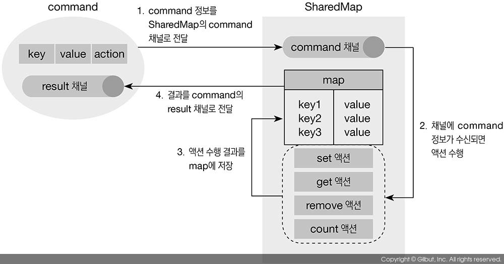
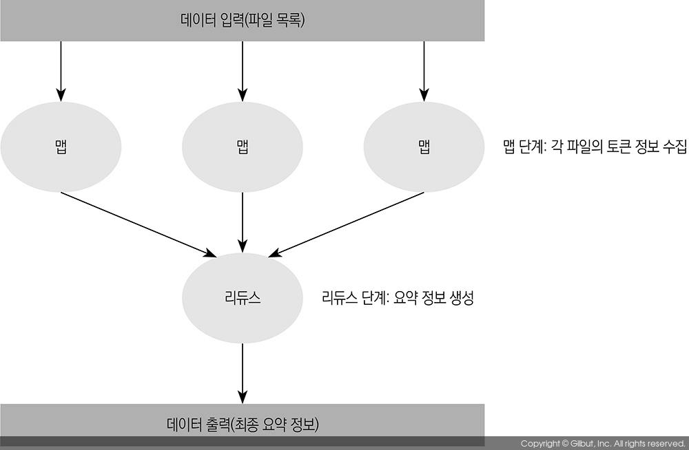

## 활용

### 타임 아웃

**시간이 오래 걸리는 작업**에 select 문을 이용하면 타임아웃 기능을 쉽게 구현할 수 있다.

```go
done := process()
timeout := time.After(10 * time.Millisecond)
 
select {
case d := <-done:
    fmt.Println(d)
case <-timeout:
    fmt.Println("Time out!")
}
```

이 코드에서는 done 채널로 process() 함수의 실행 결과를 받아오고, timeout 채널로 10밀리초 후의 시간을 받아온다. select 문은 done 채널과 timeout 채널을 동시에 대기하다가 먼저 수신되는 케이스를 수행한다.

process() 함수는 타임아웃 처리 이후에도 계속해서 동작한다. 타임아웃 처리 이후에 process() 함수의 동작 상태를 제어하기 위한 방법으로 다음 세 가지를 생각해 볼 수 있다.

1. **아무 처리도 하지 않음**

    **process() 작업이 이후 코드에 영향을 주지 않는다면** 방금 본 코드처럼 타임아웃 후 process() 작업에 아무 처리도 안 해도 된다. 단, select 구문이 종료된 후에도 process() 함수는 계속 동작할 것이고, 처리가 완료된 후 done 채널로 전송된 값은 그냥 무시된다.

2. **done 채널을 닫음**

    process() 함수에 **타임아웃 처리가 되었다는 것을 알리기 위해 done 채널을 닫을 수 있다**(close). 하지만 done 채널을 임의로 닫아버리면 process() 함수에서 처리를 완료한 후 done 채널에 처리 결과를 전송할 때 런타임 에러(panic: send on closed channel)가 발생한다. 타임아웃 처리로 done 채널을 닫을 때는 **process() 함수에서 done 채널은 외부에서 닫힐 수 있다는 것을 고려**해서 코드를 작성해야 한다.

3. **process() 함수에 타임아웃 메시지를 전송**

- - -
<br>

### 공유 메모리

다음 패턴은 뮤텍스를 사용하지 않고 공유 메모리를 사용하는 방법이다.

Go의 기본 맵은 동시성을 보장하지 않는다. 채널로 map[string]interface{} 형태의 맵을 여러 고루틴에서 공유하여 사용할 수 있게 한다.

```go
type SharedMap struct {
    m map[string]interface{} // 실제 값이 저장될 맵
    c chan command           // ShardMap에 명령을 전달하기 위한 채널
}
 
type command struct {
    key    string         
    value  interface{}   
    action int     
    result chan<- interface{}
}
```

SharedMap.c를 통해 command를 전달받고 결과값을 전달해야 할 때는 command.result를 통해 리턴한다.

</img><br/>

- - -
<br>

### 파이프라인

파이프를 통해 셸 명령어를 실행하면 각 프로세스는 파이프로 연결되고 한 프로세스의 결과가 다른 프로세스의 입력으로 전달된다.

Go의 기본 라이브러리 함수 **io.Pipe()**를 사용하면 유닉스 스타일로 파이프라인을 생성할 수 있다. io.Pipe()를 호출하면 ***PipeReader와 *PipeWriter**가 반환되는데, *PipeReader와 *PipeWriter는 내부적으로 서로 연결돼 있어서 *PipeWriter의 결과가 *PipeReader의 입력으로 바로 전달된다. 하지만 io.Pipe()는 *PipeReader와 *PipeWriter로만 연결되므로 다양하게 활용하기에는 제약이 있다.

```go
func prepare() <-chan Job {
    out := make(chan Job, BUF_SIZE)
    go func() {
        // prepare job
        for i := 0; i < JOB_COUNT; i++ {
            out <- Job{name: strconv.Itoa(i)}
        }
        close(out)
    }()
    return out
}
 
func doFirst(in <-chan Job) <-chan Job { // <-chan : 수신용 채널
    out := make(chan Job, cap(in))
    go func() {
        for job := range in {
            // first processing
            job.log += “first stage\n”
            out <- job // 송신용으로 씀
        }
        close(out)
    }()
    return out
}

func main() {
    done := doLast(doThird(doSecond(doFirst(prepare()))))
    for d := range done {
        // something
    }
}
```


파이프라인의 **각 단계는 동시에 수행**되므로 각 단계를 함수로 나누어 순차로 호출하는 것보다 훨씬 더 많은 작업을 처리할 수 있다. **여러 함수를 차례로 호출**하는 코드에 **파이프라인 패턴**을 적용하면 성능을 높일 수 있다.

<br>

파이프라인의 각 단계에서 수행하는 작업을 같은 형태의 함수로 정의할 수 있다면, handler 함수를 매개변수로 받아 처리하는 pipe() 함수를 만들어서 사용할 수 있다.

```go
type Job struct{ name, log string }
type jobHandler func(Job) Job // 각 단계에서 수행하는 작업을 정의
 
func pipe(handler jobHandler, in <-chan Job) <-chan Job {
    out := make(chan Job, cap(in))
    go func() {
        for job := range in {
            out <- handler(job)
        }
        close(out)
    }()
    return out
}

func main() {
    done := pipe(last, pipe(third, pipe(second, pipe(first, prepare()))))
    for d := range done {
        // something
    }
}
```

- - -
<br>

### 맵리듀스

맵리듀스는 **대용량 데이터를 분산**해서 빠르게 처리하려고 사용하는 프로그래밍 모델이다.

2014년 구글이 분산 데이터 처리에 관한 논문 <MapReduce: Simplified Data Processing on Large Clusters>(http://research.google.com/archive/mapreduce.html)

맵리듀스는 **흩어져 있는 데이터 조각을 종류별로 모으는** 맵(map) 단계와, 맵 작업으로 **생성된 데이터를 모두 취합하여 원하는 형태의 최종 정보를 추출**하는 리듀스(reduce) 단계로 나뉜다.

</img><br/>


